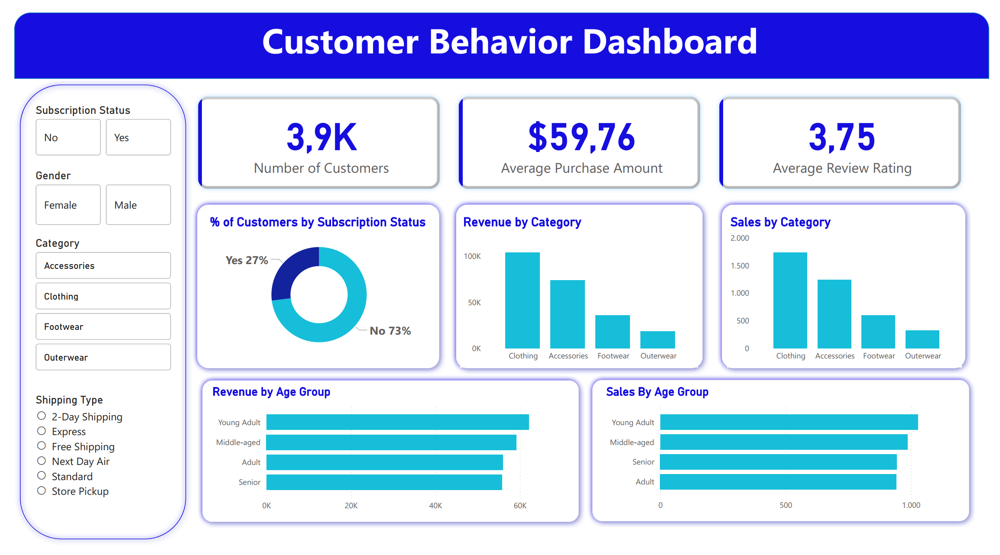

End-to-End Customer Behavior Analysis

This project performs a comprehensive analysis of consumer shopping habits, covering the entire data lifecycle from initial processing with Python and deep analysis with SQL to strategic visualization in Power BI .
Project Overview

The primary goal is to transform raw retail data into actionable business insights . The project includes:

    Cleaning & Preprocessing: Handling missing values and data standardization.

    Feature Engineering: Creating new segments and metrics for deeper analysis.

    Business Intelligence: Executing complex queries to understand customer value and product performance.

    Interactive Dashboard: Visualizing critical KPIs for data-driven decision-making .

Technologies Used

    Language: Python (Pandas).

    Database Integration: PostgreSQL & SQLAlchemy.

    Query Language: SQL.

    Visualization: Power BI .

The Dataset

The dataset contains 3,900 records of customer transactions. Key features include:

    Demographics: Age, Gender, and Location.

    Transactional Data: Purchase Amount (USD), Item Category, Color, Size, and Season.

    Behavioral Data: Purchase frequency, subscription status, and payment methods.

Project Steps
1. Data Cleaning & Feature Engineering (Python)

Using the customer_shopping_behavior_analysis.ipynb notebook, the following tasks were performed:

    Null Handling: Missing review_rating values were filled using the median rating per category.

    Feature Creation:

        Created age_group segments (Young Adult, Adult, Middle-aged, Senior) using quartiles.

        Converted categorical purchase frequencies into numerical values (purchase_frequency_days).

    Optimization: Standardized column names and removed redundant features like promo_code_used.

    Database Load: Automatically exported the cleaned data into a PostgreSQL database using SQLAlchemy.

2. Strategic Analysis (SQL)

Using customer_behavior_sql_queries.sql, business questions were addressed through:

    Customer Segmentation: Segmenting users into New, Returning, and Loyal based on previous purchase history.

    Revenue Analysis: Comparing total revenue by gender and age group.

    Product Performance: Identifying the top 5 products with the highest average review ratings and discount rates.

    Logistics & Subscriptions: Comparing average spend between shipping types and analyzing the impact of subscription status on total revenue.

3. Data Visualization (Power BI)

The customer_behavior_dashboard.pbix file consolidates the processed data into an interactive dashboard . It provides a visual overview of:

    Total revenue and category performance .

    Demographic distributions of the customer base .

    Behavioral patterns of subscribers vs. non-subscribers .
    

Key Insights

    Customer Loyalty: Customers classified as "Loyal" (over 10 previous purchases) are a primary driver of consistent revenue.

    Subscription Impact: Analyzing spending habits reveals whether subscribed customers tend to spend more per transaction than non-subscribers.
